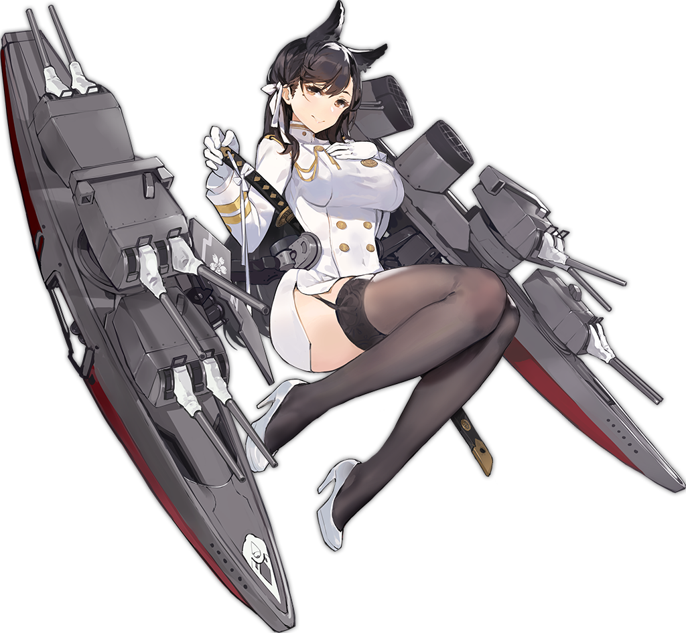

  <a href="https://azurlane.koumakan.jp/wiki/Atago#/media/File:Atago.png" style="color: gray; font-size: 10px;text-decoration: none">Illustration from Azur Lane Wiki</a>

<h1 align="center">Battleship ⚓</h1>

  
  

A Work In Progress multiplayer turn-based websocket Battleship game 🚢💥

Play the demo here: https://shirajuki.js.org/battleship/

## Built With

- JavaScript
- Preact framework
- Express
- HTML5
- CSS3
- Socket.io

## Todolist (that will probably never be completed)

- [x] Fix DnD library to be more lightweight
- [x] Style the game better overall
- [x] Add a lobby menu
- [x] Add images - web friendly assets
- [ ] Add fancy effects and particles
- [ ] Add sfx and bgm music
- [ ] Add energy system and skills

